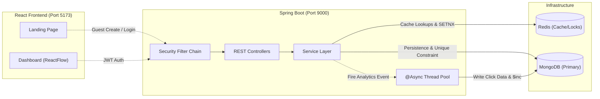
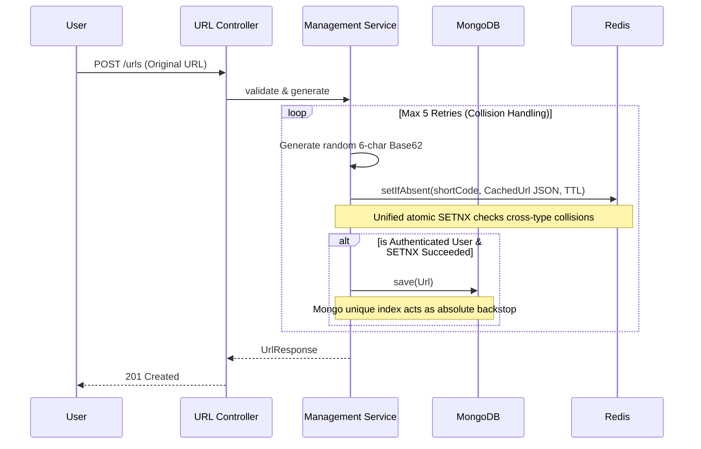
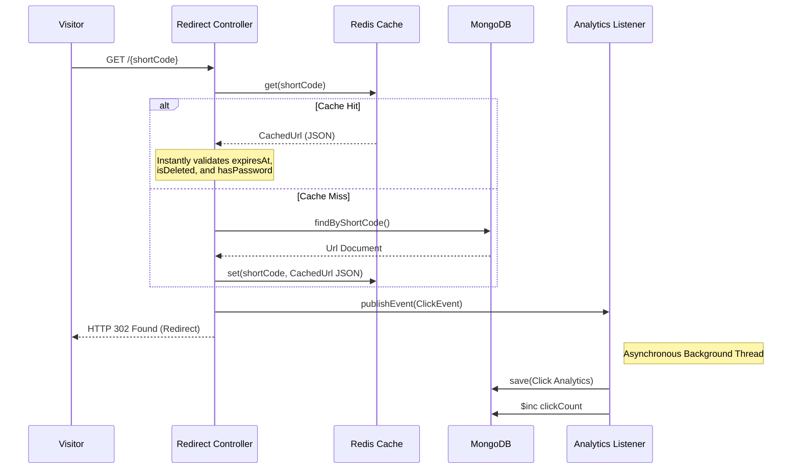

# SwiftRoute

> A high-performance URL shortener with real-time click analytics and an interactive, node-based canvas dashboard.


## Overview

SwiftRoute transforms long URLs into clean, manageable links while capturing granular click analytics asynchronously. Designed to handle high-concurrency redirect traffic without sacrificing precision, it heavily utilizes Redis as both a unified reservation layer for unique codes and a rich read-through cache. The platform is paired with a ReactFlow-powered frontend, giving users an interactive, node-based dashboard to visualize and trace their link traffic in real time.
<!--
## Demo


*Live Demo: [ADD: live demo link]*
-->
## 🚀 Key Features

**Performance & Core Shortening**
* **Instant Shortening:** Generates 6-character Base62 short links (yielding ~56.8 billion combinations) dynamically.
* **High-Speed Redirects:** Redis-first caching strategy ensures sub-millisecond redirect resolution.
* **Atomic Collision Prevention:** Relies on a unified Redis `SETNX` reservation mechanism for all links, backed by MongoDB's unique index.

**Advanced Link Management**
* **Guest Mode:** Create temporary short links instantly with a strictly enforced 24-hour TTL without an account.
* **Lifecycles:** Set precise expiration dates, securely password-protect destination URLs, and soft-delete links safely.
* **Rich Cache Objects:** Soft deletes, expirations, and passwords are comprehensively enforced even on blazing-fast cache hits.

**Analytics & Visualization**
* **Asynchronous Analytics:** Click events (IP, User-Agent, Referer) are decoupled from the redirect path and persisted via a dedicated background thread pool.
* **Interactive Canvas:** Explore link trees, visualize traffic flows, and manage links seamlessly via a drag-and-drop dashboard.

## 🛠️ Tech Stack

| Layer | Technology | Purpose |
| :--- | :--- | :--- |
| **Backend** | Java 21 & Spring Boot 3.3.2 | Core API framework managing controllers, services, validation, and async tasks. |
| **Primary Database** | MongoDB | Stores user profiles, URL metadata, and time-series click events. |
| **Cache & Locks** | Redis | High-speed cache for read-heavy redirects and atomic locks (`SETNX`) for unique code generation. |
| **Security** | Spring Security + JWT | Stateless route protection and BCrypt password hashing. |
| **JSON Processing** | Jackson | Fast serialization/deserialization for rich cache objects in Redis. |
| **Frontend UI** | React 18 & Vite | Lightning-fast component rendering and development bundling. |
| **Visualization** | ReactFlow & Recharts | Renders the node-based canvas dashboard and sparkline analytics charts. |
| **Styling** | Tailwind CSS | Utility-first styling with neon/glassmorphism design tokens. |

## 🏗️ Architecture Deep-Dive

### High-Level System Architecture



**Why Package-by-Feature?**
The backend is structured into domain modules (`url`, `auth`, `user`, `analytics`, `core`) rather than technical layers. This deliberate monolith boundary design keeps the codebase easily navigable for a single team while ensuring that extracting a heavily-loaded service—like the decoupled analytics pipeline—will be trivial if independent scaling is ever justified.

### 1. URL Creation Flow



1. **Validation:** Ensure the URL scheme is `http`/`https`, within limits (max 2048 chars), and not self-referential to prevent loops.
2. **Generation:** Roll a random 6-character Base62 string.
3. **Atomic Reservation:** Execute `SETNX` in Redis to globally reserve the code. This prevents cross-type collisions (a guest claiming a code a user just generated). 
4. **Persistence:** If the reservation succeeds, authenticated links are pushed to MongoDB. A `DuplicateKeyException` catch blocks race conditions, rolling back the Redis key and retrying.
5. **Alerting:** If 5 sequential retries fail, the system logs a critical alert, indicating a broken RNG rather than an exhausted code space.

*Why a retry-based collision strategy?* Atomic constraints (Mongo unique index, Redis `SETNX`) guarantee mathematical correctness without the cross-instance synchronization flaws of in-memory Bloom Filters.

### 2. High-Speed Redirect Flow



1. **Cache Read:** System fetches the short code directly from Redis.
2. **Rich Cache Hit:** Parses the `CachedUrl` JSON string to enforce soft-deletes, expirations, and passwords instantaneously without hitting the primary database.
3. **Fallback & Hydration:** On a cache miss, MongoDB is queried, and the retrieved document is parsed back into the rich JSON cache.
4. **Redirect:** Returns `HTTP 302 Found` to the user immediately.
5. **Async Analytics:** Offloads the click metrics to an independent thread pool to prevent blocking the visitor.

*Why rich-object caching?* Storing an object rather than a bare destination string ensures that a user interacting with a recently edited, deleted, or password-protected link receives the correct security boundary instantly, without waiting for the cache to clear.

## 🗄️ Database Schema

| Collection | Key Fields | Indexes | Why indexed this way |
| :--- | :--- | :--- | :--- |
| `users` | `email`, `passwordHash`, `name` | `email` (Unique) | Enforces unique account registration and accelerates login lookups. |
| `urls` | `shortCode`, `originalUrl`, `userId`, `expiresAt`, `clickCount` | `shortCode` (Unique), `userId` | `shortCode` enforces link uniqueness at the DB level; `userId` speeds up fetching dashboard link trees. |
| `click_events` | `urlId`, `ipAddress`, `userAgent`, `clickedAt` | Compound: `(urlId, clickedAt)` | Optimizes time-series analytics charts by filtering clicks for a specific link ordered chronologically. |

## 🔒 Security Posture

* **Stateless JWT Auth:** Tokens are issued with an expiry-only revocation model. (Note: Recommend storing securely on the frontend in `httpOnly` cookies).
* **Sanitization:** Strict regex validations scheme-allowlist (`http`/`https` only) to completely block `javascript:` or `data:` XSS vector injections.
* **Link Passwords:** Optional destination protection is hashed securely using BCrypt, never stored as plain text.
* **Topology:** Security filter chains are strictly ordered, ensuring guest creation and redirect paths are public while management endpoints require authentication.

## ⚖️ Design Decisions & Trade-offs

* **Approximate Analytics:** Analytics writes are explicitly at-most-once. If the server crashes between the 302 redirect and the async listener executing, the click is dropped. This favors raw redirect speed over billing-grade metric accuracy.
* **Client-Side Revocation:** JWTs are stateless and expire purely on their TTL. There is no server-side blocklist, meaning a stolen active token cannot be manually revoked before it expires naturally.
* **Base62 Random Generation:** Random code generation avoids sequential IDs, preventing attackers from maliciously enumerating or scraping active links via iteration.

## 🏃 Getting Started

### Prerequisites
* Java 21+
* Node.js 18+
* MongoDB (Local or Atlas)
* Redis (Local)

### Backend Setup
1. Open the `backend` directory.
2. Set the required environment variables (can be exported or added to a `.env` depending on your IDE):
   ```bash
   export SPRING_DATA_MONGODB_URI="mongodb://localhost:27017/urlshortener"
   export SPRING_REDIS_HOST="localhost"
   export APP_JWT_SECRET="<your_base64_256_bit_secret>"
   ```
3. Run the Spring Boot application (starts on port `9000`):
   ```bash
   mvn spring-boot:run
   ```

### Frontend Setup
1. Open the `frontend` directory.
2. Install dependencies:
   ```bash
   npm install
   ```
3. Start the Vite development server (starts on port `5173`):
   ```bash
   npm run dev
   ```

## 📁 Project Structure

```text
backend/src/main/java/com/urlshortener/
├── UrlShortenerApplication.java
├── analytics/           # Background metrics and event listeners
│   ├── entity/
│   ├── event/
│   ├── listener/
│   └── repository/
├── auth/                # JWT generation, validation, and user session management
│   ├── controller/
│   ├── dto/
│   ├── security/
│   └── service/
├── core/                # Cross-cutting concerns (Global exceptions, CORS, Async)
│   ├── config/
│   └── exception/
├── url/                 # Core shortening, cache handling, and redirection logic
│   ├── controller/
│   ├── dto/
│   ├── entity/
│   ├── repository/
│   └── service/
└── user/                # User profile management
    ├── entity/
    └── repository/
```

## 🗺️ Roadmap

- **Rate Limiting:** Implement token bucket rate-limiting (e.g., Bucket4j) specifically for guest creation and login endpoints to mitigate brute-force and spam link generation.
- **Refresh Tokens:** Shift to a short-lived access token and robust refresh token model to mitigate the security window of stateless JWT expiry.
- **Analytics Export API:** Expose paginated endpoints and CSV exports for power users directly from the time-series compound index.
- **Custom Domains:** Support vanity domains tied directly to registered user accounts.
